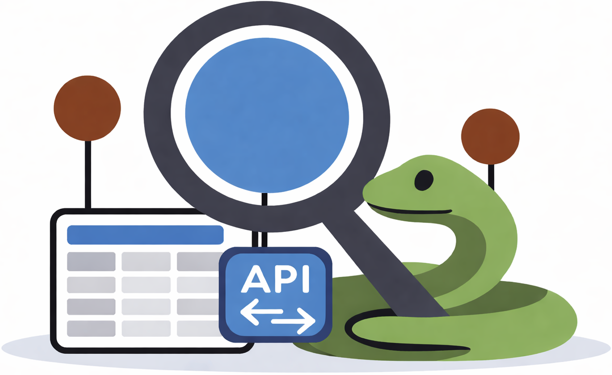

# The official Scop3P REST API Python client

[](https://doi.org/10.5281/zenodo.18889471)
[](https://github.com/Bio2Byte/scop3p-api-client/actions/workflows/jekyll-gh-pages.yml)
[](https://bio2byte.github.io/scop3p-api-client/)
[](https://github.com/Bio2Byte/scop3p-api-client/blob/main/LICENSE)
[](https://github.com/Bio2Byte/scop3p-api-client/releases)

<div align="center">
  
</div>

**[Scop3P](https://iomics.ugent.be/scop3p)**, an **ELIXIR Belgium node service**, is focused on **phospho-sites** on protein 3D structure.

> Scop3P provides a unique and powerful resource to explore and understand the impact of phospho-sites on human protein structure and function, and can thus serve as a springboard for researchers seeking to analyse and interpret a given phosphosite or phosphoprotein in a structural, biophysical, and biological context.

> The resource re-uses public domain data from a variety of leading international resources, including UniProtKB and PDB, but also uses reprocessed mass spectrometry-based phospho-proteomics data from PRIDE/ProteomExchange, which is in turn globally collected and thus wholly international-driven.

> Scop3P is developed at Ghent University and is online since June 2019. 

**Python client features:**

- CLI built with `argparse`
- Python API (`Scop3pResult`, `Scop3pRestApi`)
- Local cache with TTL and cache-fallback behavior
- Multiple output formats (JSON + TSV variants)
- FAIR-oriented provenance log written by default (`output.log`)

## Documentation

- GitHub Pages: <https://bio2byte.github.io/scop3p_api_client/>
- Docs source in this repository: [`docs/`](docs/)

## Citation

If you use this Python client, cite the project in `CITATION.cff`.

To cite Scop3P itself, please use:

> Pathmanaban Ramasamy, Demet Turan, Natalia Tichshenko, Niels Hulstaert, Elien Vandermarliere, Wim Vranken, and Lennart Martens *Scop3P: A Comprehensive Resource of Human Phosphosites within Their Full Context*. _Journal of Proteome Research (2020)_. DOI: <https://doi.org/10.1021/acs.jproteome.0c00306>


```bibtext
@article{doi:10.1021/acs.jproteome.0c00306,
    author = {
        Ramasamy, Pathmanaban and 
        Turan, Demet and 
        Tichshenko, Natalia and 
        Hulstaert, Niels and 
        Vandermarliere, Elien and 
        Vranken, Wim 
        and Martens, Lennart
    },
    title = {
        Scop3P: A Comprehensive Resource of Human Phosphosites within Their Full Context
    },
    journal = {Journal of Proteome Research},
    volume = {19},
    number = {8},
    pages = {3478-3486},
    year = {2020},
    doi = {10.1021/acs.jproteome.0c00306},
    note = {PMID: 32508104},
    URL = { https://doi.org/10.1021/acs.jproteome.0c00306 },
    eprint = { https://doi.org/10.1021/acs.jproteome.0c00306 }
}
```

# Technical details

## Compatibility

- Python: `>=3.6,<4` (from `pyproject.toml`)
- CLI entrypoint: `scop3p`:
    - `scop3p --help` or `scop3p --version`

## Install

Install from PyPI:

```bash
python -m pip install -U pip
python -m pip install scop3p
```

Install from source (editable): 

1. Clone the project to your working environment:
    ```bash
    git clone git@github.com:Bio2Byte/scop3p-api-client.git
    cd scop3p-api-client
    ```
2. Create the virtual environment: 
    ```bash
    python -m venv .venv
    source .venv/bin/activate
    python -m pip install -U pip
    python -m pip install -e .
    # Optional test/coverage tools:
    python -m pip install -e ".[test]"
    # Optional build/publish tools:
    python -m pip install build twine
    ```

## Usage

### CLI Usage

#### Phospho-sites through Scop3P REST API

```bash
# Basic usage - fetch phospho modifications for a UniProt accession
scop3p --accession O95755

# With API version
scop3p --accession O95755 --api-version 1

# FAIR provenance log is always written by default
scop3p --accession O95755
# -> writes FAIR metadata log to ./output.log

# Customize FAIR log file path
scop3p --accession O95755 --log-file run-fair.log

# Customize JSON indentation
scop3p --accession O95755 --indent 4

# Output raw (compact) JSON
scop3p --accession O95755 --raw

# Bypass cache and force fresh API request
scop3p --accession O95755 --no-cache

# Set custom cache TTL (in seconds)
scop3p --accession O95755 --cache-ttl 600

# Include structures and peptides in stdout JSON (no saved files)
scop3p --accession O95755 --include-structures --include-peptides

# Save multiple outputs in one invocation (TARGET:FORMAT:PATH)
scop3p --accession O95755 \
  --save modifications:tsv:modifications.tsv \
  --save structures:tsv:structures.tsv \
  --save peptides:json:peptides.json

# Save one output file (same --save syntax)
scop3p --accession O95755 --save modifications:json:results.json

# Export peptides as TSV without header
scop3p --accession O95755 --save peptides:tsv:peptides.tsv --no-header

# Run via module (without installing)
PYTHONPATH=./src python -m scop3p_api_client phospho --accession O95755
```

**Important Notes:**

- **Structures TSV Format**: The structures data is nested in the JSON response (each structure contains a `structureModificationsList`). When exporting to TSV, the data is automatically flattened - one row per modification with structure-level fields (pdbId, resolution, etc.) repeated for each modification.
- **Automatic endpoint selection**: requesting `structures` or `peptides` via `--save` automatically fetches those datasets.
- **Stdout enrichment**: use `--include-structures` and/or `--include-peptides` to include them in stdout JSON when not saving files.
- **Dataset JSON saves**: `--save TARGET:json:PATH` writes the normalized dataset payload for that target only (not the full `apiResult + metadata` envelope).

**CLI Arguments:**

- `--accession`: Required UniProt identifier (e.g., O95755)
- `--api-version` / `-v`: Optional API version query parameter
- `--include-structures`: Include structures in stdout JSON output
- `--include-peptides`: Include peptides in stdout JSON output
- `--save`: Repeatable output specification `TARGET:FORMAT:PATH`
  - `TARGET`: `modifications`, `structures`, `peptides`
  - `FORMAT`: `json`, `tsv`
- `--raw`: Output compact JSON (used for stdout and `json` saves)
- `--indent`: JSON indentation size (default: 2, ignored when `--raw` is set)
- `--separator`: Column separator for tabular formats (default: tab)
- `--no-header`: Omit header row in tabular output
- `--null-value`: String used for missing values in tabular output (default: `None`)
- `--log-file`: FAIR provenance log output path (default: `output.log`)
- `--no-cache`: Bypass cache (force a network request)
- `--cache-ttl`: Cache TTL in seconds (default: 300)
- `--version`: Display the installed `scop3p` CLI version and exit

## Development Tasks

The repository ships with a `Makefile` for common workflows:

```bash
make help
make test
make test-verbose
make coverage
make coverage-html
make check
make build
```

Notes:

- `make coverage` requires `coverage` (`python -m pip install -e ".[test]"`)
- `make build` requires `build` (`python -m pip install build`)

Equivalent direct commands:

```bash
PYTHONPATH=src python -m unittest discover -s tests -p "test_*.py" -v
PYTHONPATH=src python -m coverage run -m unittest discover -s tests -p "test_*.py"
python -m coverage report -m
python -m compileall src tests
```

Current test cases:

- `tests/test_api.py`: endpoint URL construction and cache behavior
- `tests/test_result.py`: result aggregation + metadata serialization
- `tests/test_output.py`: JSON/TSV/FAIR-log formatters
- `tests/test_cli.py`: argument validation, save behavior, log writing, and error exits

## Release Checklist (PyPI + BioConda)

```bash
# 1) Verify quality gates (local)
make check
make coverage

# 2) Build artifacts
make build

# 3) Validate built artifacts
python -m twine check dist/*

# 4) Upload (recommended: TestPyPI first)
python -m twine upload --repository testpypi dist/*
# then production:
# python -m twine upload dist/*
```

**Bioconda alignment checklist**:

- keep CLI testable via `scop3p --version` and a minimal invocation smoke test
- ensure runtime dependencies remain minimal and explicitly declared in `pyproject.toml`
- keep `LICENSE`, `AUTHORS.md`, and `CITATION.cff` present in source releases
- update recipe tests whenever CLI contract changes (`--save`, `--include-*`, `--log-file`, cache flags)

### Python Library Usage

You can also use the library directly in your Python code:

#### Phospho-sites through Scop3P REST API

```python
from scop3p_api_client.result import Scop3pResult

# Basic usage - fetch modifications only
result = Scop3pResult.from_api(
    accession="O95755"
)

# Include structures and peptides
result = Scop3pResult.from_api(
    accession="O95755",
    include_structures=True,
    include_peptides=True
)

# With API version and custom cache TTL
result = Scop3pResult.from_api(
    accession="O95755",
    api_version="1",
    ttl=600  # Cache for 10 minutes
)

# Disable caching
result = Scop3pResult.from_api(
    accession="O95755",
    ttl=0  # No cache
)

# Access the data
print(result.modifications)
print(result.structures)  # None if not requested
print(result.peptides)    # None if not requested
print(result.metadata)

# Convert to dictionary
data_dict = result.to_dict()

# Export as JSON string
json_output = result.dump_json(indent=2)  # Pretty-printed
json_compact = result.dump_json()         # Compact

# Save to file
with open("output.json", "w") as f:
    f.write(result.dump_json(indent=2))
```

**Using Output Formatters:**

For more control over output formatting, use the output formatter classes:

```python
from scop3p_api_client.result import Scop3pResult
from scop3p_api_client.output import (
    Scop3pResultJSONOutput,
    Scop3pResultModificationsTabularOutput,
    Scop3pResultStructuresTabularOutput,
    Scop3pResultPeptidesTabularOutput,
)

# Fetch data (uses Scop3pRestApi under the hood)
result = Scop3pResult.from_api(
    accession="O95755",
    include_structures=True,
    include_peptides=True
)

# JSON output
json_formatter = Scop3pResultJSONOutput(result, indent=2)
print(json_formatter.format())
json_formatter.write_to_file("output.json")

# Modifications as TSV
mods_formatter = Scop3pResultModificationsTabularOutput(
    result,
    separator="\t",
    include_header=True
)
print(mods_formatter.format())
mods_formatter.write_to_file("modifications.tsv")

# Structures as CSV
struct_formatter = Scop3pResultStructuresTabularOutput(
    result,
    separator=",",
    include_header=True
)
struct_formatter.write_to_file("structures.csv")

# Peptides without header
pep_formatter = Scop3pResultPeptidesTabularOutput(
    result,
    separator="\t",
    include_header=False
)
pep_formatter.print_to_console()
```

**Low-level API usage:**

The procedural helpers now wrap an underlying `Scop3pRestApi` instance. You can instantiate the class directly for more control or continue using the helper functions:

```python
from scop3p_api_client.api import (
    Scop3pRestApi,
    fetch_modifications,
    fetch_structures,
    fetch_peptides,
)

api = Scop3pRestApi()
data = api.fetch_modifications("O95755")
peptides, peptides_meta = api.fetch_peptides("O95755", return_metadata=True)

# Or keep using the functional wrappers
structures = fetch_structures("O95755")
```

---

# About us

The [Computational Omics and Systems Biology Group (CompOmics)](https://www.compomics.com), headed by Prof. Dr. Lennart Martens, is part of the Department of Biomolecular Medicine of the Faculty of Medicine and Health Sciences of Ghent University, and the VIB-UGent Center for Medical Biotechnology of VIB, both in Ghent, Belgium. The group has its roots in Ghent, but has active members all over Europe, and specializes in the management, analysis and integration of high-throughput Omics data with an aim towards establishing solid data stores, processing methods and tools to enable downstream systems biology research.

The lab [Bio2Byte](https://bio2byte.be) researches the relation between protein sequence and biophysical behavior. The group is mainly located at the Interuniversity Institute Of Bioinformatics Brussels (IB2) in Brussels, Belgium.
