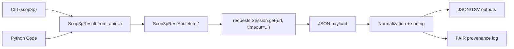
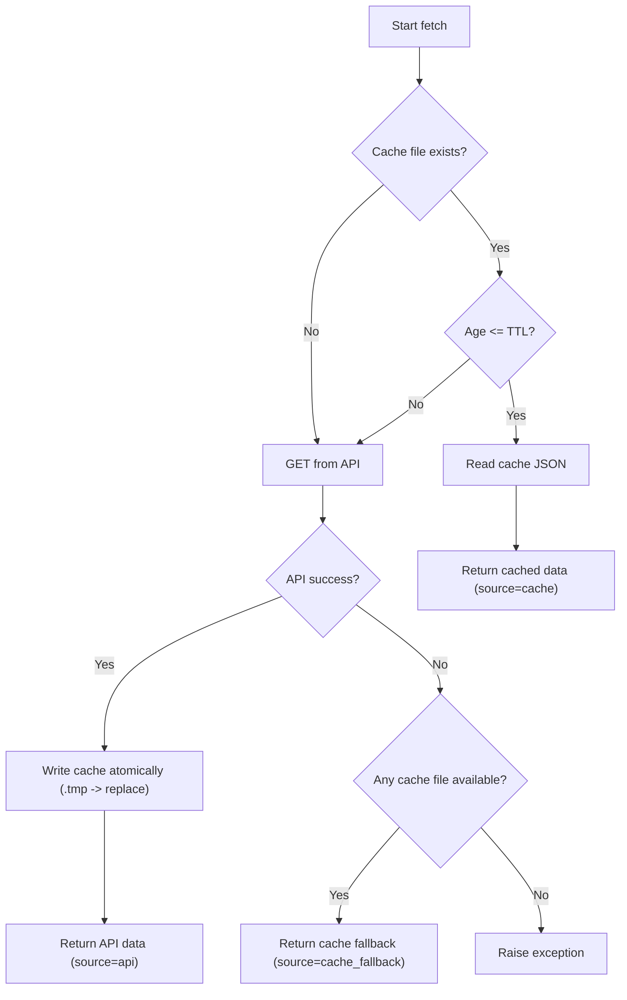
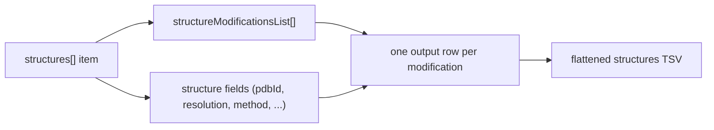

# Methodology Under The Hood

This page describes how the client queries Scop3P with `requests` GET calls and how data is processed before output.

## Request Lifecycle

The CLI and Python API both end in the same fetch layer (`Scop3pRestApi`).

## Endpoint Mapping

- Modifications: `https://iomics.ugent.be/scop3p/api/modifications`
- Structures: `https://iomics.ugent.be/scop3p/api/get-structures-modifications`
- Peptides: `https://iomics.ugent.be/scop3p/api/get-peptides-modifications`

URL behavior:

- Modifications URL is built as `?accession=<id>` and optionally `&version=<api_version>`.
- Structures and peptides use `?accession=<id>`.

## `requests` Behavior

- Transport uses `requests.Session.get(...)`.
- Default timeout is 10 seconds (unless overridden).
- A provided session can be reused, or a default session is created.

## Cache Strategy

Default TTL is 300 seconds. Cache files are JSON in the temp directory unless a cache directory is configured.

Cache key material:

- `accession`
- `api_version` (modifications only)
- dataset suffix (`modifications`, `structures`, `peptides`)

Cache file name:

- `scop3p_<sha256(accession|api_version|suffix)>.json`

## Metadata And Provenance

`Scop3pResult.from_api(...)` adds metadata including:

- execution timestamp (UTC)
- host, Python version, platform
- caching source per dataset (`api`, `cache`, `cache_fallback`)
- optional serialized CLI arguments

`Scop3pResultFairLogOutput` writes `output.log` with:

- inputs (accession)
- outputs (primary file + provenance log file)
- FAIR sections (`findable`, `accessible`, `interoperable`, `reusable`)
- provenance details and run log messages

## Output Normalization

Before serialization, payloads are normalized for stable order:

- predictable column/key ordering for known datasets
- deterministic row sorting by dataset primary keys

Structures TSV behavior:

- structures are nested (`structureModificationsList`)
- exporter flattens to one TSV row per structure modification
- structure-level fields (`pdbId`, `resolution`, etc.) are repeated per row

